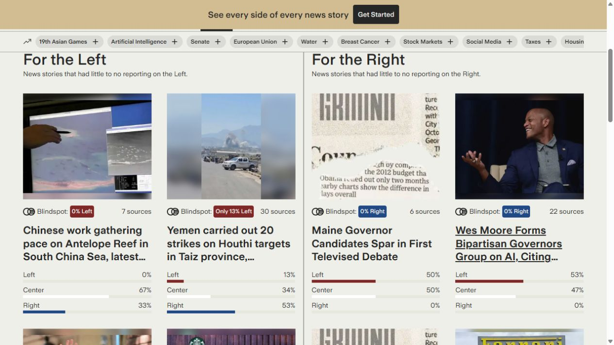
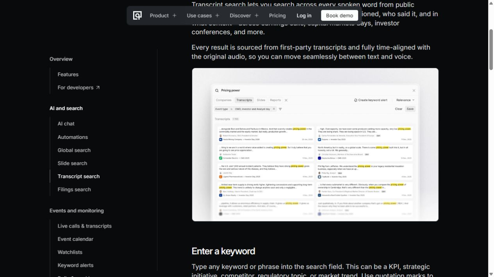
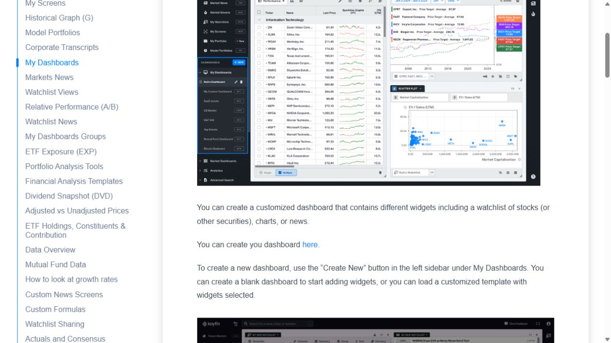
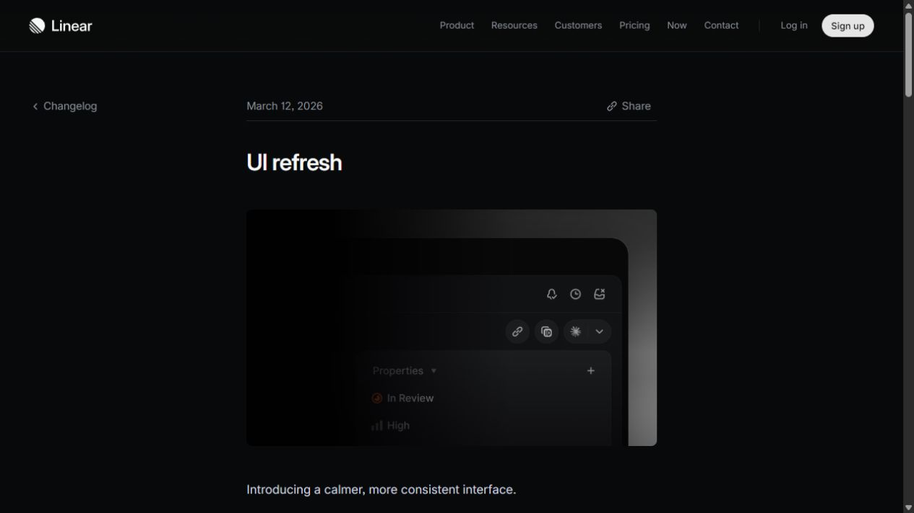

# REFERENSI — Cek Dulu

Fase 2, 2 Oktober 2026. Status: tiga referensi utama disetujui pengguna melalui pesan “setuju, lanjutkan”. Ini persetujuan referensi, bukan persetujuan implementasi.

Brief yang dipakai: KONTEN.md. Tujuan: input lebih mudah dipahami, rapor dapat dipindai, bukti dapat ditelusuri secara visual, dan satu elemen khas yang relevan dengan pemeriksaan klaim. Tema gelap dan logo yang disukai pengguna tetap menjadi batas; glassmorphism tidak dipilih.

## Metode dan batas pengamatan

- Tool yang benar-benar dipakai: Design Inspiration MCP (`design_search_references`), web search/open, dan browser in-app melalui cua_repl.
- Pencarian MCP pertama tidak menghasilkan kandidat; pencarian kedua terutama memberi galeri/konsep. Kandidat tersebut disisihkan karena tidak cukup menjelaskan alur aplikasi nyata. Pencarian dilanjutkan ke produk dan dokumentasi primer.
- Ground News, Quartr, Linear, dan halaman bantuan Koyfin diperiksa secara visual di browser; cuplikannya disimpan di `docs/design-references/`.
- Kandidat lainnya ditemukan lewat pencarian atau dibuka melalui web. Ini tidak sama dengan menguji seluruh interaksi produk, masuk ke akun berbayar, atau mengukur performa.
- Penilaian kecocokan di tabel adalah pertimbangan desain untuk Cek Dulu. Teknologi demo hanya dinyatakan pasti bila tercantum dalam sumber; kemungkinan penerapan ulang ditandai sebagai usulan.
- Screenshot merupakan bahan tinjauan internal, bukan aset untuk dipasang di produk. Tidak menyalin logo, fotografi, teks pemasaran, atau data dari referensi menjadi konten Cek Dulu. Lisensi kode diperiksa sebelum memakai implementasi demo.

## A. Produk nyata dengan kebutuhan yang mirip

| Kandidat | Bagian yang bagus untuk dipelajari | Risiko jika disalin |
|---|---|---|
| [Ground News — Blindspot](https://ground.news/blindspot) | Label konteks dan batang perbandingan membuat informasi yang terlewat lebih mudah dilihat sebelum membaca detail. Cocok untuk rapor dan perbandingan bukti | Spektrum politik bukan verdict saham. Jangan menyalin kategori bias, warna sebagai satu-satunya status, fotografi berita, atau grid kartu seragam |
| [Quartr — Transcript search](https://quartr.com/features/transcript-search) | Hasil terhubung dengan kutipan, perusahaan, tanggal dan sumber audio; relevan untuk hubungan teks input dengan bukti | Tampilan transkrip padat dan audiens profesional. Tidak mengadopsi penilaian pembicara, atau menjanjikan audio tersinkron bila backend Cek Dulu belum menyediakan timestamp |
| [Koyfin — My Dashboards](https://www.koyfin.com/help/mydashboards-myd/) | Grafik dan tabel berada dalam konteks riset keuangan, dengan pemisahan tampilan data dan pengaturan | Kepadatan terminal, tabel kecil, serta banyak widget dapat membebani pemula. Cek Dulu tidak perlu berubah menjadi aplikasi trading atau dashboard pasar |

Cuplikan yang diperiksa:

## B. Produk di luar bidang saham

| Kandidat | Bagian yang bagus untuk dipelajari | Risiko jika disalin |
|---|---|---|
| [Linear — UI refresh](https://linear.app/changelog/2026-03-12-ui-refresh) | Pemisahan navigasi, konten utama, dan detail membantu fokus dan konsistensi antarlayar | Jika menyalin tema gelap dan panelnya begitu saja, hasil dapat kembali terasa plain. Ambil hierarki, bukan seluruh identitas visual |
| [Observable Plot — Interactions](https://old.observablehq.com/plot/features/interactions) | Pemilihan titik dan tooltip mendekatkan pembaca ke nilai tepat pada grafik; relevan untuk angka yang membuka evidence | Interaksi hover saja tidak cukup untuk sentuhan dan keyboard. Tidak perlu memasang library hanya demi meniru contoh |
| [Flourish — Visualization examples](https://flourish.studio/examples/) | Contoh visualisasi menunjukkan alternatif penyampaian data selain tabel dan paragraf | Animasi cerita panjang bisa memperlambat tugas pemeriksaan. Tidak mengimpor dataset contoh atau embed layanan ke aplikasi secara otomatis |

## C. Bahan visual dari dunia pasar modal Indonesia

Ini referensi struktur informasi dan bahasa visual; bukan sumber angka baru untuk rapor dan bukan izin mengganti data Sectors.

| Kandidat | Bagian yang bagus untuk dipelajari | Risiko jika disalin |
|---|---|---|
| [Alamtri — Informasi Dividen](https://www.alamtri.com/pages/read/10/44/Informasi_Dividen) | Struktur informasi dividen memberi dasar untuk menonjolkan periode dan sifat pembayaran, bukan hanya satu angka yield | Jangan menyalin gaya situs korporat atau memasukkan angka baru ke fixture tanpa verifikasi. Logo emiten tidak berarti dukungan terhadap produk |
| [OJK — Laporan Tahunan Pasar Modal](https://ojk.go.id/id/statistik/pasar-modal/laporan-tahunan/default.aspx) | Arsip per tahun dan dokumen resmi memberi acuan keterlacakan periode dan provenance | Dokumen panjang dan tabel padat bukan layout yang cocok untuk layar pertama |
| [IDX — Laporan Keuangan BLES kuartal I 2026](https://www.idx.id/Portals/0/StaticData/ListedCompanies/Corporate_Actions/New_Info_JSX/Jenis_Informasi/01_Laporan_Keuangan/02_Soft_Copy_Laporan_Keuangan/Laporan%20Keuangan%20Tahun%202026/TW1/BLES/LaporanKeuangan-2026-I-BLES.pdf) | Laporan nyata dengan catatan memberi referensi hubungan nilai, periode, dan keterangan; relevan untuk detail bukti | Ini bahan dokumen yang ditemukan melalui pencarian, belum dievaluasi visual per halaman. Jangan menyalin tampilan PDF yang rapat atau memakai angkanya sebagai data demo |

Usulan ciri khas yang dapat diuji pada fase konsep: penanda pada kutipan klaim dan hubungan langsung ke angka/bukti, terinspirasi kebiasaan membaca laporan dan catatannya. Ini tidak membutuhkan foto stok atau ilustrasi AI.

## D. Demo teknik dan gerak

Kandidat ini inspirasi mekanisme, bukan rekomendasi menyalin website eksperimental secara utuh. Dua contoh lama tetap disertakan bila tekniknya relevan; usia demo tidak dianggap bukti dukungan browser saat ini.

| Kandidat | Bagian yang bagus untuk dipelajari | Risiko dan teknologi |
|---|---|---|
| [Codrops — 3D Stack Motion](https://github.com/codrops/3DStackMotion/) | Lapisan kartu dapat memperlihatkan hubungan klaim, pembanding, dan konteks sebagai satu objek yang dibuka pengguna | Sumber mendeskripsikan animasi stack 3D saat scroll. Scroll wajib dan perspektif berlebihan bisa menyembunyikan bukti. Usulan adaptasi: lapisan HTML/CSS yang dibuka lewat klik/tap, dengan keadaan statis untuk reduced motion; tidak diasumsikan harus WebGL |
| [Codrops — How to Animate SVG Shapes on Scroll](https://tympanus.net/Tutorials/OnScrollPathAnimations/) | Gerak SVG dapat membantu menunjukkan hubungan bagian informasi tanpa aset berat | Terdaftar pada Creative Hub dengan tag GSAP dan SVG; halaman demo timeout saat dibuka melalui web. Belum diverifikasi interaksi visualnya. Jangan mengubah skala data atau memaksa scroll untuk membaca hasil |
| [Codrops Creative Hub — Async Page Transitions](https://async-page-transitions.crnacura.workers.dev/) | Transisi antarhalaman berpotensi menjaga orientasi saat berpindah dari ringkasan ke detail | Terdaftar pada [Creative Hub](https://tympanus.net/codrops/hub/) bertanggal 26 Februari 2026 dengan tag GSAP/page transition. Halaman demo dibuka lewat web tetapi tidak menghasilkan konten teks, sehingga perilaku animasinya belum diuji. Usulan penerapan tetap harus menjaga fokus, loading/error, dan reduced motion |

Tidak memilih Rapid Image Layers, lanskap WebGL, blob, face mask, atau galeri foto sebagai arah produk: efeknya membutuhkan materi atau interaksi yang tidak membantu pemeriksaan klaim. Demo tersebut boleh menjadi eksperimen tersendiri, bukan pengisi halaman.

## Rekomendasi tiga referensi utama untuk dipilih

1. **Ground News untuk rapor:** ambil gagasan label konteks dan perbandingan visual. Kesimpulan klaim menjadi pintu masuk, lalu angka dan bukti bisa diperiksa.
2. **Quartr untuk hubungan teks–sumber:** ambil penyorotan kutipan dan metadata sumber. Terapkan hanya hubungan yang benar-benar tersedia pada input/evidence Cek Dulu, tanpa fitur audio baru otomatis.
3. **Codrops 3D Stack Motion untuk eksplorasi elemen khas:** ambil konsep lapisan, bukan seluruh animasi scroll atau foto. Uji satu elemen interaktif klaim–angka–konteks, sementara input, navigasi, dan detail tetap mudah digunakan. Ini kandidat ambisi visual, bukan keputusan teknologi.

Linear menjadi pendukung konsistensi navigasi; Observable menjadi pendukung interaksi grafik; Koyfin menjadi pembanding kepadatan yang harus dibatasi. Dokumen pasar modal menjadi sumber ciri subjek, bukan tema koran atau terminal trading.

Rekomendasi ini memilih bagian spesifik, bukan menggabungkan tiga website secara harfiah. Warna, font, token numerik, dan layout belum diputuskan pada fase referensi. Potensi dua arah teknik untuk dipertimbangkan kemudian: permukaan/lapisan yang terasa fisik tanpa kaca dan gerak untuk menelusuri bukti; tidak mengaktifkan seluruh tren sekaligus.

## Pilihan pengguna dan langkah berikutnya

- [x] Fase 1 diizinkan lanjut melalui pesan “lanjut”.
- [x] Empat kelompok berisi masing-masing tiga kandidat dengan alasan dan risiko.
- [x] Link berasal dari pencarian atau halaman yang benar-benar dibuka; batas pengamatan dinyatakan.
- [x] Cuplikan produk utama disimpan untuk tinjauan.
- [x] Pengguna memilih tiga referensi utama dan bagian yang direkomendasikan: Ground News, Quartr, Codrops 3D Stack Motion.
- [ ] Fase 3 mengambil token dari referensi terpilih lalu menyiapkan spesifikasi untuk disetujui.

Belum ada perubahan kode UI, backend, dependency, konfigurasi, atau API key. `design.md` lama tidak ditimpa.
